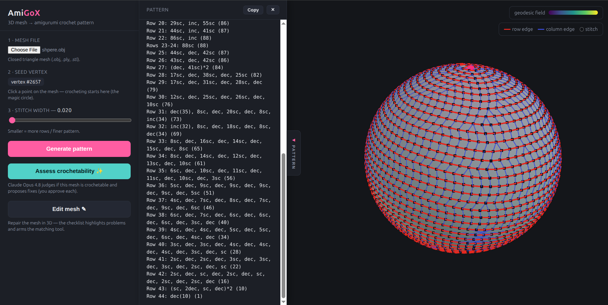

# AmiGoX — 3D mesh → amigurumi crochet pattern

AmiGoX turns a closed 3D triangle mesh into a single-piece **amigurumi crochet
pattern** — the row-by-row `sc` / `inc` / `dec` instructions a person follows to
crochet the shape. It is a from-scratch Python implementation of the AmiGo
research paper, wrapped in an interactive 3D web UI, an LLM agent that judges
and repairs uncrochetable meshes, and a crochetability-aware mesh editor.



---

## 📄 The whitepaper

This project implements:

> **AmiGo: Computational Design of Amigurumi Crochet Patterns**
> Michal Edelstein, Hila Peleg, Shahar Itzhaky, Mirela Ben-Chen.
> *ACM Symposium on Computational Fabrication (SCF), 2022.*
> DOI: [10.1145/3559400.3562005](https://doi.org/10.1145/3559400.3562005) ·
> arXiv: [2211.01178](https://arxiv.org/abs/2211.01178)

The paper's PDF (`2211.01178v1.pdf`, ~46 MB) lives in the project root locally
but is **git-ignored** to keep the repository lean — grab it from the arXiv link
above.

### Algorithm in brief (paper §3–§7)

1. **Geodesic field** `f` = geodesic distance from a seed vertex (heat method).
2. **Saddle detection** of `f` → segment the mesh at saddle isolines (handles
   limbs / branches).
3. Per segment: cut a **seam**, trace **isolines** of `f` face-by-face and sample
   them at equal arc-length → crochet-graph vertices (the stitches).
4. **DTW coupling** between consecutive rows → column edges.
5. **Transducer** walk over the rows → `sc` / `inc(x)` / `dec(x)` per stitch.
6. **Loop folding** → a compact, human-readable pattern.

> **Implementation note.** The paper solves a FEM PDE for the per-row column
> order `g`; on a closed, uncut mesh that system's right-hand side cancels to
> zero. We instead trace isolines face-by-face starting from the seam crossing,
> so arc length gives the column ordering directly — no FEM needed.

---

## What's in here

**Phase 1 — interactive web UI.** Upload a mesh, **click it to pick the seed**,
choose a stitch width, and generate. The mesh is recoloured by the geodesic
field; the **crochet graph** is overlaid in 3D (red row edges, blue column
edges, stitch dots), and the **text pattern** appears alongside.

**Phase 2 — crochetability agent (Claude Opus 4.8).** Judges whether a mesh is
crochetable by the AmiGo technique (closed, single-component, ~genus-0,
well-behaved field, thick enough features) and, **with your per-step approval**,
applies fixes. CLI (`assess.py`) and a web panel share one streaming agent core.

**Phase 3 — crochetability-aware 3D editor.** A live red/green checklist drives
repair: each failing check **auto-highlights the offending geometry** and arms
the matching tool — fill a boundary loop, delete a stray piece, inflate a thin
limb, smooth noise, or **cut a handle to reduce genus**. The agent can also
propose precise edits you preview and approve.

**Phase 4 — closed-loop seed & stitch-width optimization.** The seed vertex (the
magic-ring start) and the stitch width both strongly affect pattern quality, so
the agent now **picks them for you**. A deterministic scorer (`quality.py`) rates
each pattern for **surface coverage** (area no stitch represents), **floating
stitches** (column/row edges that span empty space across a concave/branching gap
instead of hugging the surface), and **thin segments** (features too narrow to
crochet). `suggest_stitch_width()` sizes the stitch from the narrowest feature's
girth so the thinnest part still gets enough stitches — only going finer than the
default when a narrow feature demands it. The agent lists candidate seeds
(`seed_search.py` — principal pole + geodesic farthest points), evaluates a few
**(seed, width)** pairs, reasons about what's uncovered/floating/thin, and
iterates to the best (e.g. a finer width to rescue a thin limb, a coarser one to
shed floating stitches). Toggle **"Auto-pick seed & width"** in the web UI and
*Generate* runs the optimizer (it adopts the chosen width and overlays the
culprits — red = uncovered, yellow = floating); untick it for the manual
click-to-pick workflow, where an **Auto** button beside the slider sizes the
width to the current seed's narrowest feature. The CLI (`optimize.py`) shares the
same agent core.

**Phase 5 — brush problem areas (local re-lay).** A brushed spot is a *local*
request, but seed and stitch width are *global* knobs — so re-optimizing them
can't reliably add stitches to one thin feature (a snout, an ear, a heart's
lobe). Instead you **paint the trouble area** on the mesh and **re-lay it
locally** with two complementary levers:

- **Densify** — the segment(s) you painted are re-sampled at a finer stitch
  width, so more real stitch rows land exactly there.
- **Force-segment** — a cut is injected at the *neck* of each brushed protrusion
  (its lowest-field rim) so a feature the saddle pass merged into the body gets
  its own dedicated spiral.

Toggle **"Brush problem areas"**, drag over the feature, then **Re-lay brushed
area** — it reports the before/after **stitch count**, brushed-area coverage, and
segment count (e.g. a brushed heart lobe goes 24 → 66 stitches, 3 → 4 segments).
The brushed region also weights the Phase-4 optimizer's score (`roi_coverage`),
so an auto-pick run prioritises covering it. The pipeline accepts this directly:
`amigo_pipeline_data(..., roi_vertices=, densify_factor=, force_segment=)`.

---

## Setup

```bash
python -m venv .venv && source .venv/bin/activate
pip install -r requirements.txt
```

Phases 2 & 3 use the Anthropic API. Put your key in **`amigo/.env`** (git-ignored):

```
ANTHROPIC_API_KEY=sk-ant-...
```

## Usage

```bash
# Web UI (Phases 1–3)  →  http://127.0.0.1:8000
python run_ui.py

# CLI: generate a pattern
python main.py test_soccer.obj --seed 0 --stitch-width 0.05

# CLI: assess + repair a mesh (needs ANTHROPIC_API_KEY)
python assess.py Sphere_w_hole.obj          # add --yes to auto-approve fixes

# CLI: auto-pick the best seed, then write its pattern (needs ANTHROPIC_API_KEY)
python optimize.py teddy.obj                 # add --deterministic to skip the LLM
```

Sample meshes are included (`test_soccer.obj`, `Sphere_w_hole.obj`, `harry.obj`, …).

## Project structure

```
amigo/
  mesh_ops.py      gradient / cotangent-Laplacian operators, mesh IO
  geodesics.py     heat geodesics, saddle detection, seam paths
  sampling.py      isoline face-traversal → crochet-graph vertices
  connectivity.py  DTW row coupling
  instructions.py  transducer → sc / inc / dec
  loop_folding.py  → human-readable pattern
  segmentation.py  saddle-based mesh segmentation
  pipeline.py      amigo_pipeline() (CLI) + amigo_pipeline_data() (UI)
  diagnostics.py   analyze_mesh() — topology / geometry / AmiGo-front signals
  simplify.py      global repair transforms
  localize.py      localized problem detectors (incl. tree-cotree handle loops)
  edit.py          mesh-edit ops (fill_loop, inflate, cut_handle, …)
  quality.py       pattern scorer — coverage + floating-stitch metrics (+ brushed-ROI weighting); auto stitch width
  seed_search.py   seed candidate generation (pole + geodesic FPS) + ranking
  agent.py         the agent (claude-opus-4-8): assess + seed optimization
server/
  app.py           FastAPI backend (pipeline, assess/optimize SSE, localize/edit, brush re-lay)
  static/          three.js frontend (app.js viewer + brush, edit.js editor)
main.py            CLI: mesh → pattern
assess.py          CLI: assess + repair a mesh
optimize.py        CLI: closed-loop best-seed search → pattern
run_ui.py          launch the web UI
```

## Notes & limitations

- Saddle detection uses one-ring sign-change counting; coarse meshes may miss some.
- Handle (genus) auto-detection is solid for a single clean handle; the editor's
  manual loop-pick is the reliable fallback on messy or higher-genus meshes.
- The browser editor's interactive tools (brush select, move gizmo, live preview)
  require a WebGL browser and a network connection (three.js loads from a CDN).

### Branching shapes (join-as-you-go)

Multi-limb shapes are crocheted as a body plus joined limbs (the pattern shows
`— New limb: work N sc into the boundary —`). This works well at typical stitch
widths, but two cases are imperfect:

- **Peanut / strongly-concave cross-sections at very fine stitch widths.** If a
  cross-section wraps two limbs in one concave loop that only separates near the
  tips (e.g. a heart seeded from its bottom point), the limbs split into small
  caps and a few long column edges remain at fine widths (~`w ≤ 0.02`). This is a
  fundamental limit of row-by-row crochet on concave loops, not a tuning issue —
  seed from a limb, use a coarser width, or reshape with the editor to avoid it.
- **Open meshes with a thin seed band.** If the segment containing the seed is
  too small to crochet, the pattern can start at a limb (no initial magic ring).
  Make the mesh watertight first (the Phase-2 agent or the editor's *fill loop*
  tool will do this).
